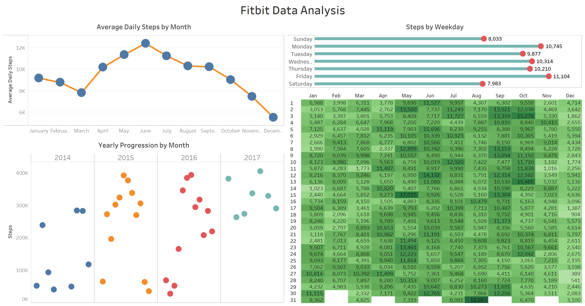

# fitbit-data-analysis
Project to analyze data collected from my fitbit devices over the last few years. The data includes weight, heart rate, workouts (not available via fitbit yet), and general daily activity

## Steps
1. Downloaded data from the "data export" section of fitbit.com (I only use the categories "activities" and "body")
2. Run the start.sh script to clean, prepare, and create visualizations

## Future work
1. Once fitbit enables exporting of exercise data, download it and create graphs based on it.

## Tableau Dashboard

## TODO
-Client 1 vs Client 2 (related to the jan v jan analysis)

-Getting daily average temp

Analysis/Graphical representation:

	-exercise time by DOW

	-exercise calories/hour by DOW

	-frequently skipped exercise day of the week

-graph general trends

	-trend of steps and general weather patterns (avg temp per week)